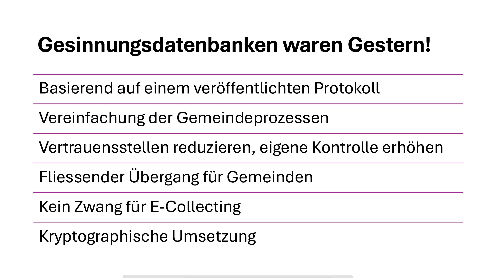
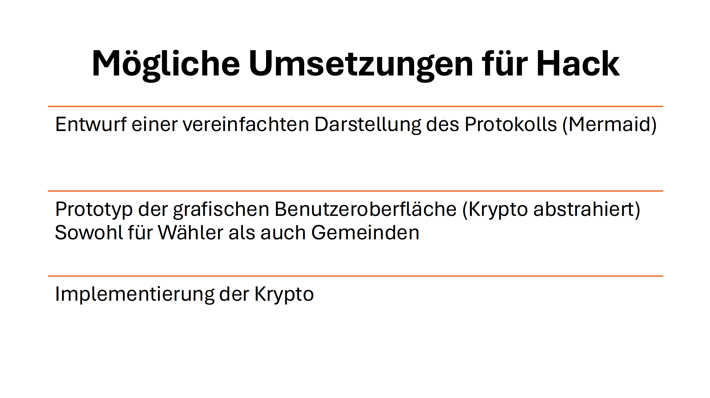

# 6) Anonymous Fully Verifiable E-Collecting

*Over the course of two days, you will develop your solution for collecting electronic signatures for popular initiatives and referendums from A to Z, addressing the 10 topics outlined in the [guidelines](https://www.bk.admin.ch/bk/de/home/politische-rechte/e-collecting/aktuelles.html). Your prototype can be conceptual, clickable, and/or technical. Either way, you should clearly present the interactions and data flows between actors, software, and infrastructure components over time, as well as the user experience of these actors.*

## Approach

## Documentation and Diagrams

*Together, you will contribute to comparing different ways of how to implement e-collecting in Switzerland from A to Z. As part of the [participatory process](https://www.bk.admin.ch/bk/de/home/politische-rechte/e-collecting/partizipativer_prozess.html), your solutions will be discussed in subsequent workshops and will possibly be taken into account for the official decision on the design of the federal e-collecting trials. Proper documentation is key to ensuring that your solution can be understood and evaluated:*

1. **[Mermaid](https://mermaid.js.org/) diagram(s) showing interactions and data flows between actors, software and infrastructure components of your solution over time.**
2. **Wireframes or mockups with user flow showing the user experience of different actors** (using e.g. Figma)
3. Explain how you addressed the topics presented in the [guidelines](https://www.bk.admin.ch/bk/de/home/politische-rechte/e-collecting/aktuelles.html), filling in the template below.
4. List the key strengths and weaknesses of your solution.
5. Explanation of features used (if applicable)
6. A requirements file with all packages and versions used (if applicable)
7. Environment code to be run (if applicable)

--------

# Privacy-Preserving Verifiable Hybrid E-Collecting
_A Trust-Minimized Protocol for Gradual Transition to Verifiable E-Collecting_

This proposal extends **LH15** ([link](https://e-voting.bfh.ch/app/download/6106455461/LH15.pdf?t=1609753513)), a peer-reviewed cryptographic protocol for anonymous participation, to support **hybrid e-collecting**. It explicitly supports the coexistence of **traditional paper-based** and **electronic** signature collection, with strong guarantees (Topic 3, Topic 5, Topic 6, Topic 8):

- No duplicate participations
- Seamless 'upgrade' path from paper to electronic participation
- No single trusted central authorities holding secrets
- No compromise of voter privacy (Keine Gesinnungsdatenbank)

Despite its cryptographic rigor, the system remains **lightweight** and **privacy-preserving** at scale.
(Topic 9 auf Betreiberebene)

**LH15** provides the following security properties on cryptographic level as a Zero knowledge proof (ZKP): 
An anonymous Set-membership-proof with single use Rate-Limiter under zero knowledge. 

Semantically, the **ZKP** provides the following proof: "I am a member of the eligibility set, and I have not yet voted on that matter."

In the **LH15** paper the complete protocol run is provided in a concise way in Figure 3.
## Key Concept: Seamless Bootstrapping from Paper to Hybrid

The protocol enables a **simple initial deployment** that builds directly on **current paper-based processes**, then **evolves naturally** into a full hybrid system — without requiring abrupt system changes or voter behavior shifts. The eventual transition to the pure electronic form provides everlasting participation privacy.

## Bootstrapping Strategy

### 1. **Start: Paper-Only Collection Using Cryptographic Anchors**

- Each municipality associates a **secret value $\gamma$ (gamma)** with every eligible voter.
    
- Upon receiving a valid **paper signature (vote)**, the municipality:
    
    - Encrypts the corresponding $\gamma$ using the public encryption key $pk$ for the given event.
        
    - Posts the encrypted value $f = E_{pk}(\gamma)$ to the **Public Bulletin Board (PBB)** over an **authenticated channel**
        
- This step anchors each vote cryptographically — **without requiring** any **voter-side infrastructure**.
      
The system remains fully paper-based but already supports:
- **Electronic universal verifiable tallying** (Topic 5, 6)
- **Electronic Participation Verifiability** (Topic 5, 6)
- **Eligibility Verifiability** (Topic 5, Topic 6)
    

### 2. **Full Hybrid: Dual Submission Channels**
If the municipality is ready, it then opens the e-collecting channel towards its citizens. 
#### a) Register for Electronic Participation

- A voter installs the official app (wallet) and opts in to electronic participation.
    
- The municipality **shares the secret $\gamma$** with the voter **securely**, enabling the voter to store their participation credential within the app.
    
- With  γ the voter creates the extended LH15 private tuple $(\alpha, \beta, \gamma)$ within the wallet and can compute the public credential $u=h_1^\alpha \cdot h_2^\beta \cdot h_3^\gamma$.
  
- The public credential is then sent **over an authentic channel** to the municipality.
  
- The municipality can now **provide** an **eligibility set** on a **daily** base.
    
The voter has now been given the ability to also participate electronically — using the same underlying data as in the paper-based phase. (Topic 8)

#### b) Vote Submission

- For voting, the voter can now also chose the electronic channel: Therefore they create  the mentioned **zero-knowledge proof of eligibility** along with an **encryption of $\gamma$** in their app and send it to the **Public Bulletin Board**:
    
    - $e = E_{pk}(\gamma)$
        
    - Plus LH15 proofs $(\pi_1, \pi_2, \pi_3)$ extended with $\gamma$:
	     - $\pi_1$: unchanged (LH15)
	    - $\pi_2: \text{NIZKP}[(u, r, α, β, γ, s) : c = com_p(u,r) \wedge d = com_q(\alpha, \beta, \gamma, s) \wedge u = h_1^\alpha * h_2^\beta * h_3^\gamma]$

	    - $\pi_3: \text{NIZKP}[(α, β, γ, s, t) : d = com_q(\alpha, \beta, \gamma, s) \wedge \hat{u} = \hat{h}^\beta \wedge e = E_{pk}(\gamma, t)]$

    - This then is sent to the **Public Bulletin Board (PBB)** over an **anonymous channel** (e.g. TOR)
      
    - Only valid tuples  $(c,d,\hat{u}, e, \pi_1, \pi_2, \pi_3 )$ are accepted
        
- - After the voting period, the system runs a privacy preserving **Plaintext Equality Test (PET)** between:
    
    - All encrypted $\gamma$ values from electronic votes ($e$)
        
    - All encrypted $\gamma$ values from paper submissions ($f$)
        
- Duplicates are detected and resolved without revealing the voter’s identities.
  
- In order to have a more **accurate tally** during the **voting phase**, **additional PETs** can be run more frequently, e.g. weekly based.
    
The system is now fully hybrid gaining the following properties:
- **No double participations** (Topic 5, Topic 8)
- **Participation-privacy for all participants** (Topic 7)
- **Fully verifiable** (Topic 6))

### 3. **Electronic Only**

- If desired, the paper option can be eradicated from the system. This brings the benefit of voiding the attack path for the 'Unterschrifte Bschiss', and liberates from  distributed trust assumptions strengthening participation privacy. The system can drop the need for `γ` so the voter now only has to create the original **LH15 zero-knowledge proof of eligibility** on their wallet to be sent to the **Public Bulletin Board** over an anonymous channel:
  
    * Proofs $(\pi_1, \pi_2, \pi_3)$ as per the original LH15 protocol
      
    - This then is sent to the **Public Bulletin Board (PBB)** over an **anonymous channel**
      
    - Only valid tuples $(\pi_1, \pi_2, \pi_3)$ are accepted
      
    - At any time, the actual tally is provided by all valid $(\pi_1, \pi_2, \pi_3)$ tuples.
    
The system is now complete electronic gaining the following properties:
- **No double participations** even during voting period (Topic 5)
- **Everlasting Participation-privacy for all participants** (Topic 7)
- **Fully verifiable** (Topic 5, Topic 6)
- **Simplicity** The municipality does not have to check or manage any signatures anymore. (Topic 9)
    
## Benefits of This Bootstrapping Approach

- **No hard cutover**: Municipalities can continue paper collection with cryptographic augmentation.
    
- **Low entry barrier**: Voters need not change behavior unless they choose to.
    
- **Scalable trust model**: Voters gain full privacy and autonomy by opting in.
    
- **Continuity of existing processes**: Paper-based workflows remain compatible.
    
- **Universal verifiability**: All steps — including registration, submission, and tallying — are publicly auditable.
        
## Conclusion

This protocol **extends the peer-reviewed LH15** with a simple cryptographic mechanism that enables municipalities to **bootstrap hybrid e-collecting** from existing paper-based workflows — with:

- **No need for immediate infrastructure change**  
- **Strong participation privacy** 
- **Universal, disputefree verifiability**
- **No trust in central authorities**
    

Voters and municipalities can transition smoothly, at their own pace, while preserving the 'feeling' of the current system. 

------------

*Add or reference wireframes or mockups with user flow showing the user experience of different actors.*

## Topics addressed

The following topics presented in the [guidelines](https://www.bk.admin.ch/bk/de/home/politische-rechte/e-collecting/aktuelles.html) are directly addressed by the proposed protocol:

**Topic 5** «Ausschluss unrechtmässiger Unterstützungsbekundungen» (vgl. Kapitel 2.7 Postulatsbericht)

**Topic 6** «Verhinderung unterschlagener Unterstützungsbekundungen» (vgl. Kapitel 2.7 Postulatsbericht)

**Topic 7** «Wahrung des Stimmgeheimnisses» (vgl. Kapitel 2.7 Postulatsbericht)

**Topic 8** «Integration mit dem papierbasierten Prozess»

**Topic 9** «Erleichterte Einführung für Gemeinden mit Effizienzgewinn; auf der Grundlage von bestehender Infrastruktur und bestehenden Prozessen»

| Topic | (How) is it addressed?                                                                                                                                                                                                                                                           |
| ----- | -------------------------------------------------------------------------------------------------------------------------------------------------------------------------------------------------------------------------------------------------------------------------------- |
| 5     | **Start: Paper-Only Collection Using Cryptographic Anchors** - Electronic universal verifiable tallying - Electronic Participation Verifiability - Eligibility Verifiability   **Electronic Only** - No double participations even during voting period - Fully verifiable |
| 6     | **Start: Paper-Only Collection Using Cryptographic Anchors** - Electronic universal verifiable tallying - Electronic Participation Verifiability - Eligibility Verifiability  **Electronic Only** -Fully verifiable                                                        |
| 7     | **Full Hybrid: Dual Submission Channels** Participation-privacy for all participants  **Electronic Only** Everlasting Participation-privacy for all participants                                                                                               |
| 8     | **Start: Paper-Only Collection Using Cryptographic Anchors**  **Full Hybrid: Dual Submission Channels** After the voting period, the system runs a privacy preserving **Plaintext Equality Test (PET)**                                                                    |
| 9     | **Introduction** Despite its cryptographic rigor, the system remains **lightweight** and **privacy-preserving** at scale.  **3. Electronic only** Simplicity as the municipality does not have to check or manage any signatures anymore.                                  |

## Key Strenghts and Weaknesses

*List the key strengths and weaknesses of your solution.*

### Strengths:
- See Conclusion

### Weaknesses:
- If a PET results in a match
  - **The municipality** will **learn** about the fact that a **specific voter** participated over **both channels**. But the municipality does not learn more than that.
  - **The system** learns that **some voter** has participated over **both channels** and the **tally changes** accordingly. But the system does not learn more than that.

## Getting Started

*These instructions will get you a copy of the technical prototype (if applicable) up and running on your local machine for development and testing purposes. **If you are not developing a technical prototype, please present or reference your conceptual and/or clickable prototype.***

### Prerequisites

*What things you need to install the software and how to install them.*

### Installation

*A step by step series of examples that tell you how to get a development env running.*

## Contributing

Please read [CONTRIBUTING.md](/CONTRIBUTING.md) for details on our code of conduct.

## Team Members

- Reto Koenig/knr1 (role)
- Philipp Locher/philoc (role)
- Name/GitHub Account (role)
- ...

## License

This software is licensed under a AGPL 3.0 License - see the [LICENSE](LICENSE) file for details. Please feel free to [choose any other](https://choosealicense.com/) [Open Source Initiative approved license](https://opensource.org/licenses) (e.g. a permissive license such as [MIT](https://opensource.org/license/mit)). Other content (e.g. text, images, etc.) is licensed under a [Creative Commons CC BY-SA 4.0 license](https://creativecommons.org/licenses/by-sa/4.0/deed.de). Exceptions are possible in consultation with the organizers.
