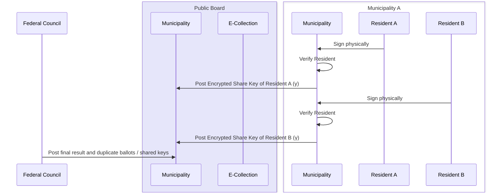
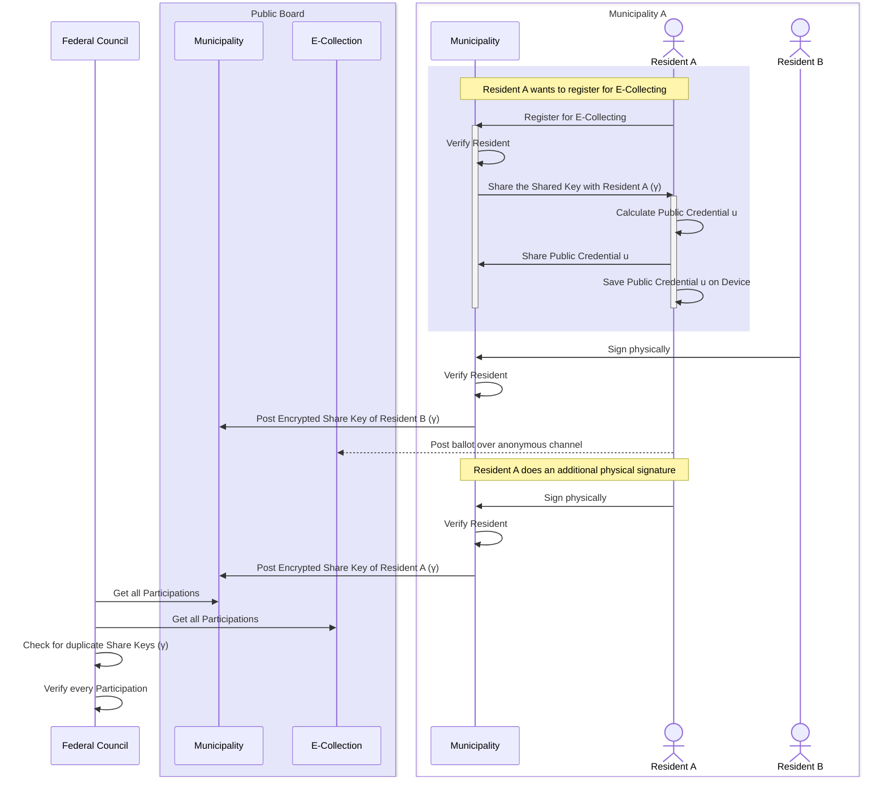
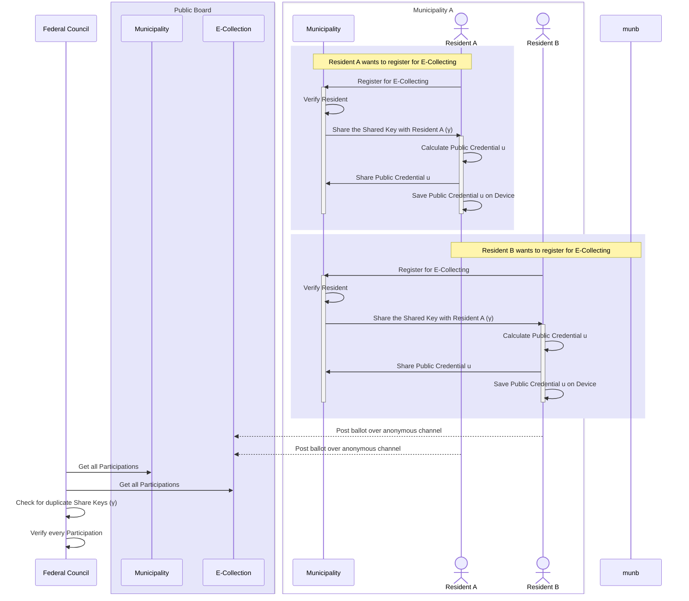

# Physical Signatures only

```mermaid
sequenceDiagram
    participant fedc as Federal Council
    box rgb(230,230,250) Public Board
        participant boardmun as Municipality
        participant boardecol as E-Collection
    end
    
    box Municipality A
        participant muna as Municipality
        participant resa as Resident A
        participant resb as Resident B
    end

    resa->>muna: Sign physically
    muna->>muna: Verify Resident
    muna->>boardmun: Post Encrypted Share Key of Resident A (γ)

    resb->>muna: Sign physically
    muna->>muna: Verify Resident
    muna->>boardmun: Post Encrypted Share Key of Resident B (γ)
    fedc->>boardmun: Post final result and duplicate ballots / shared keys

```

# Hybrid Mode

```mermaid
sequenceDiagram

    participant fedc as Federal Council

    box rgb(230,230,250) Public Board
        participant boardmun as Municipality
        participant boardecol as E-Collection
    end
    
    box Municipality A
        participant muna as Municipality
        actor resa as Resident A
        actor resb as Resident B
    end

    rect rgb(230,230,250)
    Note over muna,resa: Resident A wants to register for E-Collecting
    resa->>muna: Register for E-Collecting
    activate muna
    muna->>muna: Verify Resident
    muna->>resa: Share the Shared Key with Resident A (γ)
    activate resa
    resa->>resa: Calculate Public Credential u
    resa->>muna: Share Public Credential u
    resa->>resa: Save Public Credential u on Device
    deactivate resa
    deactivate muna
    end

    resb->>muna: Sign physically
    muna->>muna: Verify Resident
    muna->>boardmun: Post Encrypted Share Key of Resident B (γ)


    resa-->>boardecol: Post ballot over anonymous channel


    note over resa,muna: Resident A does an additional physical signature
    resa->>muna: Sign physically
    muna->>muna: Verify Resident
    muna->>boardmun: Post Encrypted Share Key of Resident A (γ)

    fedc->>boardmun: Get all Participations
    fedc->>boardecol: Get all Participations
    fedc->>fedc: Check for duplicate Share Keys (γ)
    fedc->>fedc: Verify every Participation
    
```

# Online Mode only

```mermaid
sequenceDiagram

    participant fedc as Federal Council

    box rgb(230,230,250) Public Board
        participant boardmun as Municipality
        participant boardecol as E-Collection
    end
    
    box Municipality A
        participant muna as Municipality
        actor resa as Resident A
        actor resb as Resident B
    end

    rect rgb(230,230,250)
    Note over muna,resa: Resident A wants to register for E-Collecting
    resa->>muna: Register for E-Collecting
    activate muna
    muna->>muna: Verify Resident
    muna->>resa: Share the Shared Key with Resident A (γ)
    activate resa
    resa->>resa: Calculate Public Credential u
    resa->>muna: Share Public Credential u
    resa->>resa: Save Public Credential u on Device
    deactivate resa
    deactivate muna
    end


    rect rgb(230,230,250)
    Note over munb,resa: Resident B wants to register for E-Collecting
    resb->>muna: Register for E-Collecting
    activate muna
    muna->>muna: Verify Resident
    muna->>resb: Share the Shared Key with Resident A (γ)
    activate resb
    resb->>resb: Calculate Public Credential u
    resb->>muna: Share Public Credential u
    resb->>resb: Save Public Credential u on Device
    deactivate resb
    deactivate muna
    end

    resb-->>boardecol: Post ballot over anonymous channel


    resa-->>boardecol: Post ballot over anonymous channel

    fedc->>boardmun: Get all Participations
    fedc->>boardecol: Get all Participations
    fedc->>fedc: Check for duplicate Share Keys (γ)
    fedc->>fedc: Verify every Participation

```